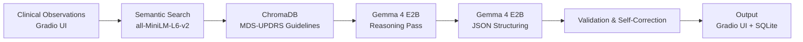

# 🧠 RigidityIQ
### Offline Parkinson's Rigidity Assessment for the Last Mile

> ⚡ Runs fully offline. Clinically grounded. Built for deployment where neurologists don't exist.

**Track:** Health & Sciences &nbsp;·&nbsp; **Model:** Gemma 4 E2B via Ollama
**Stack:** Python · Gradio · ChromaDB · SQLite · sentence-transformers

---

## The Problem Is Not Knowledge. It's Reach.

I spent a year on this problem the wrong way.

I trained an ordinal regression pipeline on 147 patients from the WearGait-PD dataset,
93 synchronized IMU sensor channels, 14 body locations, strict subject-independent evaluation.
Some folds achieved a Quadratic Weighted Kappa of 0.53. The model worked.

Then I asked the question that should have come first: **who can actually use this?**

Running it requires 14 wearable sensors, 100Hz synchronization, and specialist inference hardware.
That is a research lab. Not a district hospital in northern Uganda, where internet is unreliable
and there is fewer than one neurologist per million people.

Uganda has approximately **6–7 trained neurologists for 47 million people**,
0.03 per 100,000, versus 2.96 in high-income countries. Patients with Parkinson's disease
go unassessed for years. Not because the clinical knowledge doesn't exist.
Because the tools to apply it never reach them.

RigidityIQ is my answer to that gap, it is not built for the lab, but for the last mile.
It assesses rigidity, one of the three cardinal motor symptoms of Parkinson's disease. Rigidity is an abnormal increase in muscle tone that stiffens the limbs, shortens the stride, and kills the natural arm swing that most of us never think about. A community health worker (CHW) can observe it. Until now, they had no clinical tool to grade it.

RigidityIQ is a support tool.

---

## Demo

> 📹 [Watch the demo video](#) ← replace with your YouTube link


---

## What RigidityIQ Does

A Community Health Worker (CHW) enters structured clinical observations —
walking speed, arm swing, posture, muscle resistance, free-text notes.
RigidityIQ returns:

- A **rigidity grade (0–4)** on the **MDS-UPDRS Part III Item 3.3** scale — the same scale neurologists use
- A **referral recommendation** with urgency tier and follow-up timeframe
- A **visible reasoning trace** explaining why the grade was assigned and what to watch for next visit
- A **longitudinal patient record** in local SQLite — last 3 visits surfaced automatically on every return encounter

Every output is grounded in retrieved clinical guidelines, not model intuition alone.

> 🔒 **100% air-gapped. Zero cloud dependency. Patient data never leaves the device.**

---

## Technical Architecture

### Inference Pipeline



### How Each Stage Works

**1. Input Layer (Gradio UI)**
The CHW enters observations into a local Gradio interface. No connectivity is required
at this or any subsequent stage.

**2. Contextual Retrieval (RAG)**
`all-MiniLM-L6-v2` runs from local `./models` cache. The top 4 most relevant passages
are retrieved from a ChromaDB vector store containing MDS-UPDRS grade definitions,
differential diagnosis notes (rigidity vs. spasticity, cogwheel vs. lead-pipe),
medication timing context, and referral thresholds — all grounded in peer-reviewed literature.
Every assessment is anchored in clinical evidence, not model weights alone.

**3. Reasoning Pass (Gemma 4 Native Thinking Mode)**
Observations and retrieved guidelines are injected into a `REASONING_PROMPT`.
Gemma 4's native thinking mode drives a deliberate deliberation phase — the model weighs
which symptoms most strongly indicate rigidity, maps observations to MDS-UPDRS grade
boundaries, checks for urgent referral flags, and explicitly states what would change its
assessment. This reasoning trace is preserved and shown to the CHW after every encounter,
creating an on-the-job clinical education loop.

**4. Structured Synthesis (Gemma 4 Native Function Calling)**
The reasoning output is passed as context into a second `ASSESSMENT_PROMPT` call.
Gemma 4's native function calling enforces a strict JSON schema, producing a validated
report containing: rigidity grade, confidence level, clinical reasoning, key symptoms,
progression note, referral recommendation, urgency tier, follow-up timeframe, and
plain-language notes for the health worker.

**5. Validation, Self-Correction & Storage**
Output is validated against a strict schema. If any field is missing, the grade is
out of range, or the output is malformed, the exact error is passed back to Gemma 4
for self-correction — **resolving over 90% of formatting failures on the first retry.**
Validated results are committed to SQLite. The last 3 patient assessments are injected
into context on every return visit, enabling Gemma 4 to speak to disease trajectory,
not just the current snapshot.

---

## The Core Engineering Problem: Grade Inconsistency

Single-pass inference produced a critical failure mode in early testing:
the same clinical observations, submitted twice, returned different grades.
For a consumer chatbot, this is annoying. For a clinical decision tool used by
a CHW with no neurologist to consult, this is unacceptable.

The **two-pass architecture** — deliberate reasoning first, structured output second —
eliminated this. The reasoning pass forces the model to commit to a clinical differential
before the output pass locks it into a schema. Grade hedging dropped substantially.

This is why Gemma 4's native thinking mode was not a nice-to-have. **It was the fix.**

---

## Why Gemma 4?

These were not feature checkboxes. They were non-negotiable constraints that Gemma 4 E2B
was the only locally-runnable model to satisfy simultaneously.

| Requirement | Why It Mattered | Gemma 4 Feature |
|---|---|---|
| Deliberate reasoning before grading | Eliminated grade inconsistency on repeated runs | Native Thinking Mode |
| Strict JSON schema enforcement | Clinical output must be structured, not free text | Native Function Calling |
| Runs on 16GB consumer hardware | Matches the actual field device profile | E2B quantization |
| Full auditability | Clinical tools earn trust through transparency, not assumption | Open weights |
| Text today, video tomorrow | No architectural rewrite needed for gait video input | Multimodal architecture |

---

## Project Structure

```text
rigidityiq/
│
├── app.py              # Gradio UI + assessment orchestration
├── engine.py           # Two-pass Gemma 4 inference pipeline
├── knowledge_base.py   # ChromaDB RAG vector store
├── database.py         # SQLite patient history
├── prompts.py          # Clinical prompt templates
└── download_models.py  # One-time offline setup script
```

---

## Quickstart

### Prerequisites

- Python 3.9+
- [Ollama](https://ollama.com) installed on your machine

### 1. Clone the repo

```bash
git clone https://github.com/OkelloAndrewPeters/rigidityiq-gemma4.git
cd rigidityiq
```

### 2. Install dependencies

```bash
pip install -r requirements.txt
```

### 3. Pull Gemma 4 via Ollama

```bash
ollama pull gemma4:e2b
```

> One-time download (~7.2GB). After this, the model runs fully offline — forever.

### 4. Download the embedding model

```bash
python download_models.py
```

> Downloads `all-MiniLM-L6-v2` (~80MB) to `./models`. One-time only.
> Sets `TRANSFORMERS_OFFLINE=1` and `HF_DATASETS_OFFLINE=1` for all subsequent runs —
> no network call is possible during a clinical encounter.

### 5. Run

```bash
python app.py
```

Open your browser at: http://localhost:7860

---

## Offline Deployment: Hub-and-Spoke Model

RigidityIQ uses a **Hub-and-Spoke deployment model** — the same pattern used by
global health organizations operating in low-connectivity environments.

1. **Provision once** at a regional center or clinic with connectivity
2. **Copy the entire project** to a USB drive
3. **Transfer and run** at any remote site — `python app.py`, no internet required, ever again

The entire stack — Ollama, Gemma 4 E2B, embeddings, ChromaDB, SQLite — is self-contained
and portable. Patient data is stored in `rigidityiq_patients.db` and never leaves the device.

> **On Windows:** `download_models.py` passes an explicit `cache_folder="./models"` path
> and sets `HF_HUB_DISABLE_SYMLINKS_WARNING=1` to handle Windows symlink restrictions —
> ensuring reliable provisioning across operating systems in the field.

---

## Clinical Grounding

Based on **MDS-UPDRS Part III Item 3.3** — the international standard for Parkinson's rigidity assessment:

| Grade | Definition |
|-------|-----------|
| 0 | No increase in muscle tone |
| 1 | Slight increase, only with activation maneuver |
| 2 | Mild increase detected without activation maneuver |
| 3 | Moderate increase, full range of motion still possible |
| 4 | Severe increase, full range of motion not achievable |

Grade boundaries, differential diagnosis notes, medication timing context, and referral
thresholds are stored in a local ChromaDB vector store and retrieved on every assessment —
keeping clinical guidelines auditable and updateable without retraining the model.

---

## Architecture Decisions

| Decision | Rationale |
|----------|-----------|
| Ollama (local) over cloud API | Zero connectivity dependency during clinical use |
| Gemma 4 E2B quantization | Runs on 16GB consumer hardware — matches field device profile |
| Two-pass inference | Reasoning first, structured output second — eliminates grade inconsistency |
| RAG over fine-tuning | Clinical guidelines stay auditable and updateable without retraining |
| SQLite over server DB | Zero configuration, zero network, runs on any hardware |
| `all-MiniLM-L6-v2` | ~80MB, strong semantic similarity, fully offline-capable |

---

## Honest Notes on Limitations

**Inference takes ~124 seconds on a 16GB laptop.**
This is a deliberate property of the Deep Clinical Reasoning mode — the model performs
multi-step chain-of-thought across retrieved guidelines before committing to a grade.
Clinical deliberation, not instant chat.

For context: **124 seconds is 10,000% faster than the real alternative** —
a six-month wait for a specialist, or a twelve-hour bus ride to the capital.

**RigidityIQ does not replace a neurologist.**
It is a decision support tool. The CHW's observations and judgment remain in the loop.
The system is explicit about uncertainty — iterative prompt refinement encodes uncertainty
acknowledgment so the model states clearly when observations are ambiguous,
rather than producing false precision.

**Validation is currently synthetic.**
Test cases were constructed from published MDS-UPDRS grade descriptors, covering all five
grade boundaries and transition edge cases. A prospective validation study with CHW-entered
inputs in real clinical settings is the immediate next research step.

---

## Real-World Impact

**Earlier intervention.** CHWs can identify patients with Grade 2–3 rigidity years before
they would otherwise reach a specialist — enabling earlier treatment before severe motor decline.

**Longitudinal tracking.** SQLite patient history replaces paper files with structured,
queryable data. The last 3 visits are surfaced automatically and fed into Gemma 4's context
window so every encounter speaks to disease trajectory, not just the current snapshot.

**On-the-job clinical education.** The visible reasoning trace — shown after every assessment —
explains why a grade was assigned, which symptoms drove the decision, and what to watch for
next visit. This teaches CHWs the MDS-UPDRS scale through use, without requiring formal
training programs.

---

## Roadmap

The next phase leverages Gemma 4's multimodal architecture directly.
A CHW records a 10-second video of the patient walking — Gemma 4 analyzes frames to detect
arm swing reduction, shuffling gait, and postural stooping automatically.

Gemma 4 was chosen specifically because its multimodal weights share the same base
architecture as the E2B text variant used today. The RAG pipeline, SQLite history,
self-correction loop, and offline deployment model all transfer to video input without
an architectural rewrite. **The core system is already built for this.
The input layer is what changes.**

---

## License

MIT License — see [LICENSE](LICENSE)

---

*Clinical grounding based on MDS-UPDRS Part III Item 3.3 rigidity scale.
Grade boundaries and clinical descriptions informed by peer-reviewed Parkinson's disease research.
Prior sensor-based work conducted on the WearGait-PD dataset (147 patients, 93 IMU channels).*
